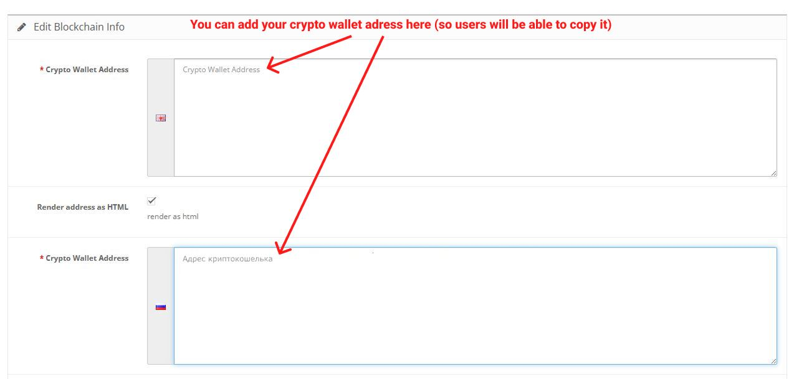
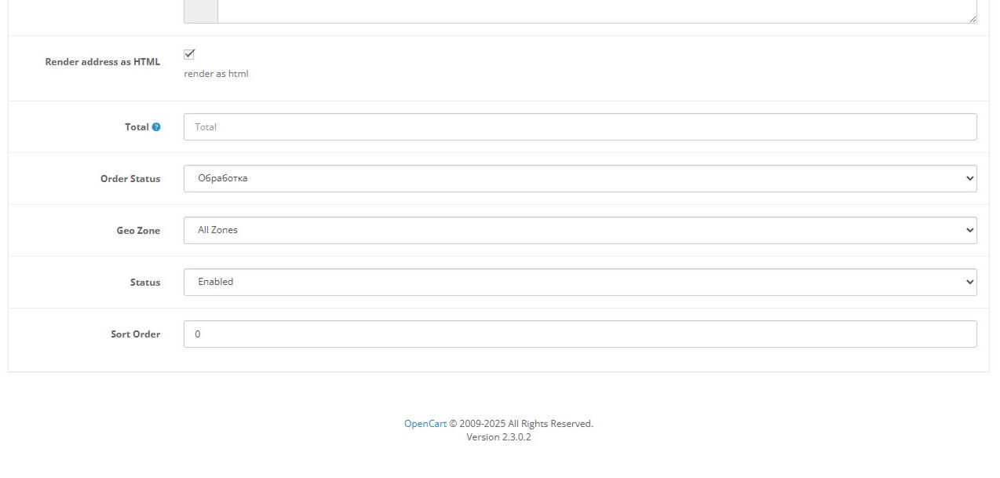
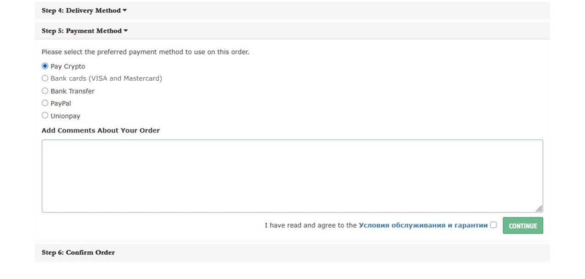
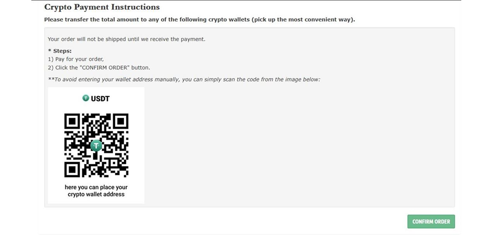

# Crypto QR Payment Method for OpenCart 2.3

Custom OpenCart 2.3 payment method module that allows customers to pay using cryptocurrency via a QR code and wallet address displayed during checkout.

This module was developed as a lightweight, dependency-free solution without external APIs or third-party services.

---

## Features

- QR-based cryptocurrency payment
- Wallet address displayed alongside QR code
- Admin-configurable payment details
- Multilingual support (EN / RU)
- Suports HTML rendering (there's a switch in the admin interface)
- Uses OpenCart OCMod (no core file editing)
- No external APIs
- No cron jobs
- No private keys stored

---

## Compatibility

- OpenCart: **2.3.x**
- PHP: **5.6 – 7.4**

---

## How it works

1. Customer selects the crypto payment method during checkout
2. QR code and wallet address are displayed
3. Customer sends payment manually using their crypto wallet
4. Order is created with a pending status
5. Payment confirmation is handled manually by the store owner

> This module intentionally does **not** interact with the blockchain
> and does **not** include automatic confirmations or callbacks.

---

## Installation

1. Upload module files to your OpenCart installation via FTP
2. Install the OCMod file from the admin panel
3. Refresh modifications
4. Enable the payment method in:
   **Extensions → Payments**
5. Configure wallet address and settings

---

## Screenshots

### Admin panel

### Checkout (frontend)

> Screenshots use a **non-real wallet address and QR code** for demonstration purposes.

---

## Technical notes

### OCMod header modification

The module includes an OCMod modification for:

catalog/controller/common/header.php

This is required due to OpenCart 2.x limitations when rendering payment data
during checkout, where certain variables may be unavailable at runtime.

The modification is implemented via **OCMod only** and does not alter core files directly.
It can be disabled or removed safely.

---

### Order history rendering fixes

The module includes several OCMod patches related to order history rendering
in both the customer account area and the admin panel.

These patches address common OpenCart 2.x issues such as:
- missing line breaks in order comments
- HTML entities displayed as plain text
- inconsistent rendering between AJAX and non-AJAX templates

All changes are limited to output formatting and do not affect
order data storage or business logic.

---

## Security considerations

- No private keys are stored
- No blockchain access
- No payment verification logic
- No external requests

This design minimizes attack surface and keeps the module simple and transparent.

---

## Use case

This module is suitable for:
- Manual crypto payments
- Small stores
- Experimental or internal projects
- Situations where automatic blockchain integration is unnecessary

---

## Author

Developed by **Shadowww**

---

## License

MIT